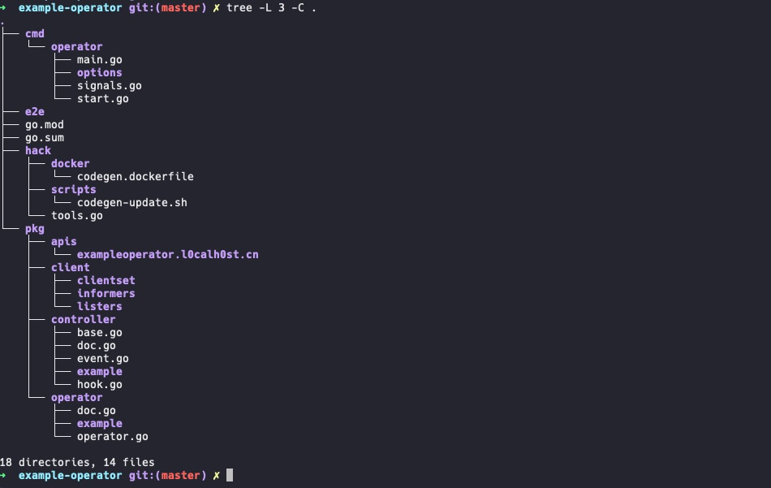

# k8s-crd-bootstrap
used to bootstrap a empty k8s controller project for crd

# PROJECT LAYOUT



# Usage
```bash
➜  TestProject bash generate_controller.sh example-operator v1alpha1 l0calh0st
generate_controller.sh: line 559: Hook: command not found
generate_controller.sh: line 688: Operator: command not found
generate_controller.sh: line 688: Operator: command not found
chmod: example-operator/hack/codegen-update.sh: No such file or directory
go: creating new go.mod: module github.com/l0calh0st/example-operator
go: to add module requirements and sums:
	go mod tidy
go: finding module for package k8s.io/component-base/term
go: finding module for package k8s.io/component-base/cli/flag
go: finding module for package github.com/spf13/pflag
go: finding module for package golang.org/x/sync/errgroup
go: finding module for package github.com/prometheus/client_golang/prometheus/promhttp
go: finding module for package k8s.io/component-base/logs
go: finding module for package github.com/spf13/cobra
go: finding module for package k8s.io/klog/v2
go: finding module for package k8s.io/code-generator
go: finding module for package k8s.io/apimachinery/pkg/apis/meta/v1
go: finding module for package k8s.io/apimachinery/pkg/runtime
go: finding module for package k8s.io/apimachinery/pkg/runtime/schema
go: found github.com/prometheus/client_golang/prometheus/promhttp in github.com/prometheus/client_golang v1.11.0
go: found github.com/spf13/cobra in github.com/spf13/cobra v1.2.1
go: found golang.org/x/sync/errgroup in golang.org/x/sync v0.0.0-20210220032951-036812b2e83c
go: found k8s.io/component-base/cli/flag in k8s.io/component-base v0.23.0
go: found k8s.io/component-base/logs in k8s.io/component-base v0.23.0
go: found k8s.io/component-base/term in k8s.io/component-base v0.23.0
go: found k8s.io/klog/v2 in k8s.io/klog/v2 v2.30.0
go: found github.com/spf13/pflag in github.com/spf13/pflag v1.0.5
go: found k8s.io/code-generator in k8s.io/code-generator v0.23.0
go: found k8s.io/apimachinery/pkg/apis/meta/v1 in k8s.io/apimachinery v0.23.0
go: found k8s.io/apimachinery/pkg/runtime in k8s.io/apimachinery v0.23.0
go: found k8s.io/apimachinery/pkg/runtime/schema in k8s.io/apimachinery v0.23.0
Building codgen Docker image ....
[+] Building 0.2s (10/10) FINISHED
 => [internal] load build definition from codegen.dockerfile                                                                                                                                                                                                               0.0s
 => => transferring dockerfile: 394B                                                                                                                                                                                                                                       0.0s
 => [internal] load .dockerignore                                                                                                                                                                                                                                          0.0s
 => => transferring context: 2B                                                                                                                                                                                                                                            0.0s
 => [internal] load metadata for docker.io/library/golang:1.17.2                                                                                                                                                                                                           0.0s
 => [1/6] FROM docker.io/library/golang:1.17.2                                                                                                                                                                                                                             0.0s
 => CACHED [2/6] RUN go get k8s.io/code-generator; exit 0                                                                                                                                                                                                                  0.0s
 => CACHED [3/6] WORKDIR /go/src/k8s.io/code-generator                                                                                                                                                                                                                     0.0s
 => CACHED [4/6] RUN go get -d ./...                                                                                                                                                                                                                                       0.0s
 => CACHED [5/6] RUN mkdir -p /go/src/github.com/l0calh0st/example-operator                                                                                                                                                                                                0.0s
 => CACHED [6/6] WORKDIR /go/src/github.com/l0calh0st/example-operator                                                                                                                                                                                                     0.0s
 => exporting to image                                                                                                                                                                                                                                                     0.0s
 => => exporting layers                                                                                                                                                                                                                                                    0.0s
 => => writing image sha256:1858fd9dd2eccab847bbac32cc409ccf28b516385a30965496eb0d4f72196e30                                                                                                                                                                               0.0s
 => => naming to docker.io/library/kubernetes-codegen:latest                                                                                                                                                                                                               0.0s

Use 'docker scan' to run Snyk tests against images to find vulnerabilities and learn how to fix them
Generating client codes ....
go: downloading k8s.io/code-generator v0.23.0
go: downloading k8s.io/component-base v0.23.0
go: downloading github.com/prometheus/client_golang v1.11.0
go: downloading github.com/spf13/cobra v1.2.1
go: downloading golang.org/x/sync v0.0.0-20210220032951-036812b2e83c
go: downloading k8s.io/apimachinery v0.23.0
go: downloading github.com/prometheus/client_model v0.2.0
go: downloading github.com/prometheus/common v0.28.0
go: downloading github.com/inconshreveable/mousetrap v1.0.0
go: downloading github.com/moby/term v0.0.0-20210610120745-9d4ed1856297
go: downloading github.com/beorn7/perks v1.0.1
go: downloading github.com/cespare/xxhash/v2 v2.1.1
go: downloading github.com/prometheus/procfs v0.6.0
go: downloading github.com/matttproud/golang_protobuf_extensions v1.0.2-0.20181231171920-c182affec369
go: downloading k8s.io/utils v0.0.0-20210930125809-cb0fa318a74b
go: downloading github.com/google/gofuzz v1.1.0
go: downloading github.com/google/go-cmp v0.5.5
go: downloading github.com/stretchr/testify v1.7.0
go: downloading github.com/creack/pty v1.1.11
go: downloading gotest.tools/v3 v3.0.3
go: downloading gopkg.in/inf.v0 v0.9.1
go: downloading sigs.k8s.io/json v0.0.0-20211020170558-c049b76a60c6
go: downloading github.com/davecgh/go-spew v1.1.1
go: downloading github.com/Azure/go-ansiterm v0.0.0-20210617225240-d185dfc1b5a1
go: downloading github.com/pmezard/go-difflib v1.0.0
go: downloading gopkg.in/check.v1 v1.0.0-20200227125254-8fa46927fb4f
go: downloading github.com/pkg/errors v0.9.1
go: downloading github.com/niemeyer/pretty v0.0.0-20200227124842-a10e7caefd8e
go: downloading github.com/kr/text v0.2.0
go: downloading github.com/cespare/xxhash v1.1.0
Generating deepcopy funcs
Generating clientset for exampleoperator.l0calh0st.cn:v1alpha1 at github.com/l0calh0st/example-operator/pkg/client/clientset
Generating listers for exampleoperator.l0calh0st.cn:v1alpha1 at github.com/l0calh0st/example-operator/pkg/client/listers
Generating informers for exampleoperator.l0calh0st.cn:v1alpha1 at github.com/l0calh0st/example-operator/pkg/client/informers
➜  TestProject tree -L 3 example-operator -C
example-operator
├── cmd
│   └── operator
│       ├── main.go
│       ├── options
│       ├── signals.go
│       └── start.go
├── e2e
├── go.mod
├── go.sum
├── hack
│   ├── docker
│   │   └── codegen.dockerfile
│   ├── scripts
│   │   └── codegen-update.sh
│   └── tools.go
├── pkg
│   ├── apis
│   │   └── exampleoperator.l0calh0st.cn
│   ├── client
│   │   ├── clientset
│   │   ├── informers
│   │   └── listers
│   ├── controller
│   │   ├── base.go
│   │   ├── doc.go
│   │   ├── event.go
│   │   └── hook.go
│   └── operator
│       └── doc.go
```


